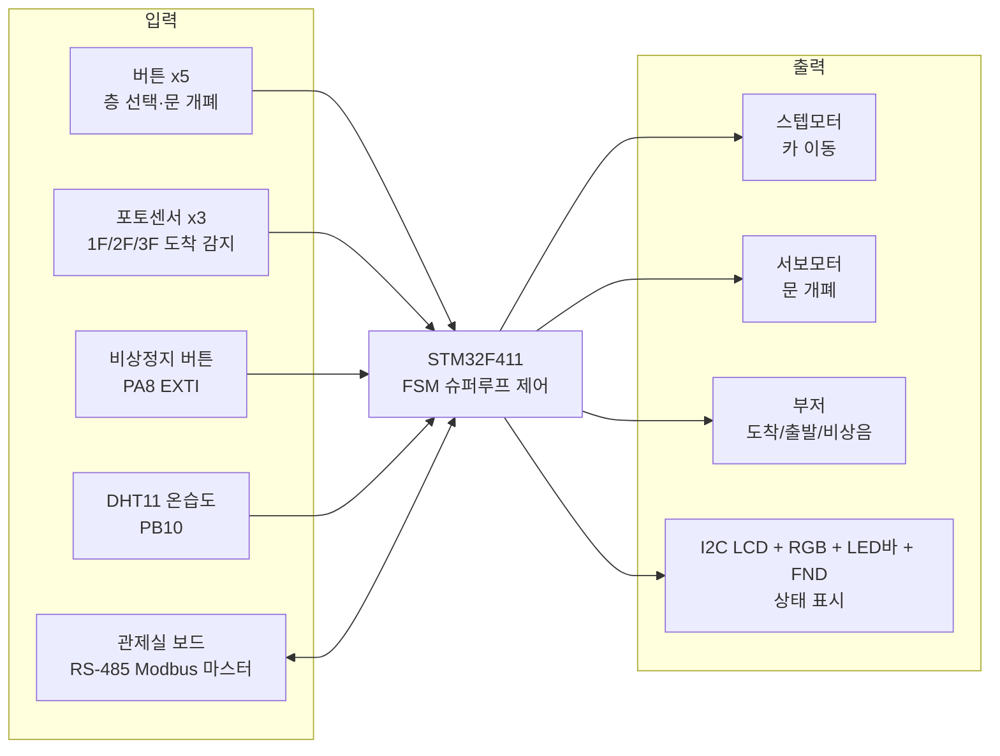
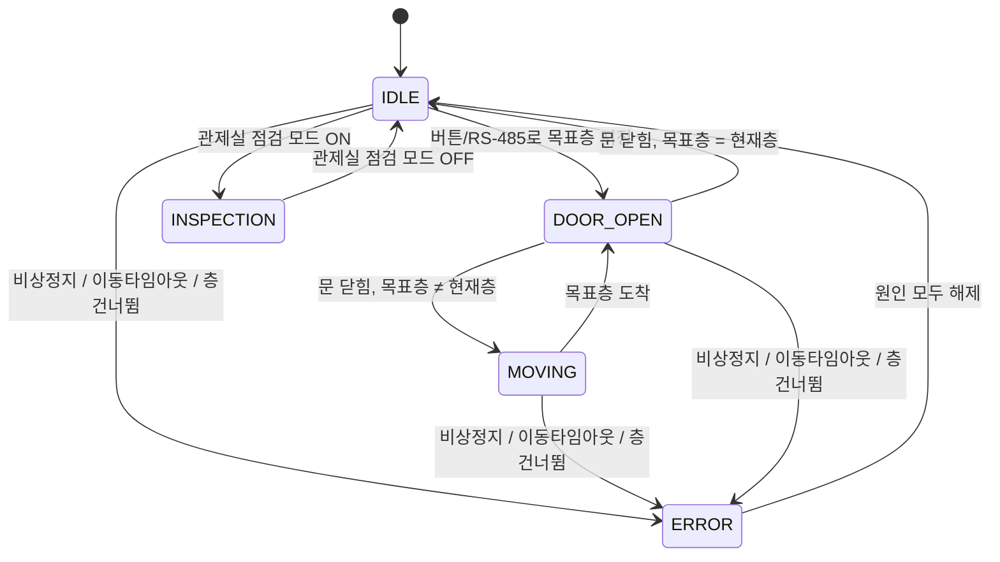
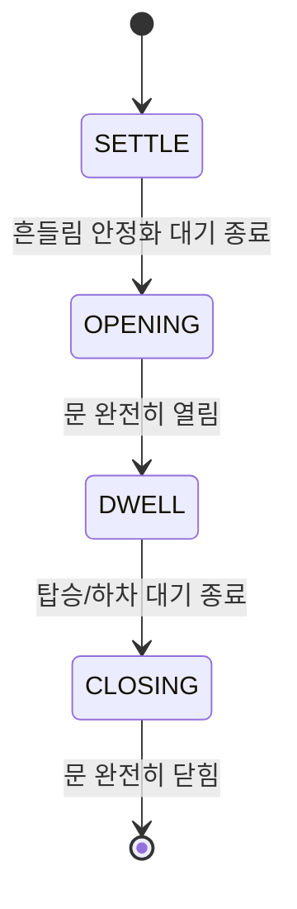

<div align="center">

# 🛗 STM32F411 엘리베이터 카 제어 시스템 : RS-485 Modbus 기반 3층 엘리베이터 제어

### Elevator Car Control System (Personal Project)

<br>


<br>


</div>
<br>

<!-- 사진/시연 영상 추후 첨부 예정 -->
<p align="center">
  
</p>

<br>

<p align="center">    &nbsp;  </p><p align="center"><i>디오라마 전면 (좌) · 후면 회로 구성 (우)</i></p>

<br>

3층 규모의 엘리베이터 카(car)를 논블로킹 FSM으로 제어하는 **STM32F411 기반 임베디드 시스템**입니다. 스텝모터로 카를 이동시키고, 서보모터로 문을 여닫으며, 포토센서로 층을 감지합니다. **RS-485(Modbus RTU)로 별도의 관제실 보드와 통신**하여 원격에서 목표층 지정, 비상정지 해제, 점검 모드 전환, 온·습도 모니터링이 가능하며, 이동 타임아웃·층 건너뜀·고온 경고 등을 감지하는 **계층형 오류코드 체계(E101~E402)**를 갖췄습니다.

<br>

## 0. 목차

1. [시연](#1-시연)
2. [핵심 기술 요약](#2-핵심-기술-요약)
3. [프로젝트 개요](#3-프로젝트-개요)
4. [주요 기능](#4-주요-기능)
5. [시스템 구성](#5-시스템-구성)
6. [아키텍처](#6-아키텍처)
7. [핀맵](#7-핀맵)
8. [상태 전이](#8-상태-전이)
9. [실행 구조](#9-실행-구조)
10. [설계 포인트](#10-설계-포인트)
11. [Troubleshooting](#11-troubleshooting)
12. [한계 및 차기 프로젝트 반영](#12-한계-및-차기-프로젝트-반영)
13. [빌드](#13-빌드)

<br>

## 1. 시연

<!-- 시연 GIF·영상은 추후 첨부 예정 -->

버튼으로 목표층을 누르면 문이 닫히고 스텝모터가 카를 이동시키며, 도착하면 문이 자동으로 열립니다. 관제실 보드에서 RS-485로 같은 명령(목표층 지정, 비상정지 해제 등)을 원격으로 내릴 수도 있고, LCD와 LED로 현재 상태·온습도·오류코드를 실시간 확인할 수 있습니다.

▶ **전체 시연 영상** : 추후 링크 첨부 예정 — 층 버튼 이동, RS-485 원격 제어, 비상정지·층 건너뜀·이동 타임아웃 오류 발생/해제, 점검 모드 전환

<br>

## 2. 핵심 기술 요약

| 분류 | 핵심 기술 |
|---|---|
| **MCU** | STM32F411RETx, STM32Cube HAL 기반 |
| **FSM** | 5-state 논블로킹 상태머신 (IDLE / MOVING / DOOR_OPEN / ERROR / INSPECTION) |
| **통신** | RS-485 반이중, Modbus RTU 슬레이브 직접 구현 (CRC16, 레지스터 맵 9종) |
| **PWM** | 서보모터(문 개폐) + 부저(음계+엔벨로프) 동시 구동 |
| **GPIO 직접 통신** | DHT11 온습도 센서 — 정해진 시간 간격(마이크로초 단위)에 맞춰 GPIO 핀 하나로 신호를 직접 주고받는 방식 |
| **모터 제어** | 4상 스텝모터 하프스텝 시퀀스 직접 구동, 거리 비례 이동 타임아웃 |
| **안전 설계** | 히스테리시스 고온 경고, 층 건너뜀 감지, IWDG 워치독, 비상정지 EXTI 즉시 정지 |
| **구조** | 논블로킹 슈퍼루프, 3계층 아키텍처(App/BSP/Core), STM32CubeIDE 빌드 |

<br>

## 3. 프로젝트 개요

**기간** : 2026.06.24 ~ 08.04 | **인원** : 개인 프로젝트

### 3-1. 프로젝트 일정

| 일정 | 단계 |
|---|---|
| 06.24 | FSM 제어 모듈 뼈대 구현 (엘리베이터 상태머신, 테스트벤치) |
| 07.19 | 3계층(App/BSP/Core) 구조로 전체 리팩토링, I2C LCD 연동, 점검 모드, RGB 상태 표시 추가 |
| 07.20 | 계층형 오류코드 체계(E101~E402) 및 거리 비례 이동 타임아웃 도입 |
| 07.27 | 오류코드 표시 로직과 층 이동 판정 로직 단순화 |
| 08.03 ~ 04 | 빌드 산출물 추적 해제·`.gitignore` 정리, 데드 코드 제거, 주석 정비 및 문서화 |

### 3-2. 담당 범위

개인 프로젝트로 하드웨어 배선부터 FSM 설계, Modbus 통신 프로토콜 구현, 오류코드 체계 설계, 디버깅까지 전 과정을 직접 진행했습니다. 관제실(F429, 마스터) 보드와 짝을 이루는 구조로, 이 저장소는 그중 **엘리베이터 카(F411, 슬레이브)** 쪽을 담당합니다.

<br>

## 4. 주요 기능

- **층 이동** : 버튼(1~3층) 또는 RS-485 원격 명령으로 목표층 지정 시 스텝모터가 카를 이동, 포토센서 3개(1F/2F/3F)로 도착 감지
- **문 개폐** : 도착 후 흔들림이 가라앉기를 기다렸다가(SETTLE) 문을 열고, 탑승/하차 대기(DWELL) 후 자동으로 닫힘(OPENING→DWELL→CLOSING) — 수동 문 열기/닫기 버튼도 지원
- **RS-485 원격 제어** : 관제실 보드가 Modbus RTU(0x03 읽기 / 0x06 쓰기)로 현재층·목표층·상태·온습도·오류코드를 조회하고, 목표층·비상정지·점검모드를 원격으로 설정
- **안전 잠금(ERROR)** : 비상정지 버튼, 이동 타임아웃(정해진 시간 안에 도착 못 함), 층 건너뜀(센서를 못 지나침) 중 하나라도 발생하면 즉시 정지 후 잠금, 원인이 모두 사라져야 해제
- **점검 모드(INSPECTION)** : 관제실이 RS-485로 점검 모드를 켜면 운행을 멈추고 대기, 관제실이 해제할 때까지 유지
- **환경 모니터링** : DHT11로 온·습도를 5초 주기로 측정, 고온(31℃ 이상) 시 경고 코드 발생(28℃ 이하로 내려가야 해제)
- **상태 표시** : LCD(I2C 1602)·RGB LED·8-LED 바(운행 방향)·7세그먼트(현재층/오류)로 상태를 동시에 표시

<br>

## 5. 시스템 구성



<br>

## 6. 아키텍처

CubeMX가 생성한 HAL 초기화 코드(`Core/`)와, 직접 작성한 디바이스 드라이버(`BSP/`)·제어 정책(`App/`)을 분리한 구조입니다.

```
┌──────────────────────────────────────────────────┐
│                                                  │
│   App/       제어 정책 (FSM, 언제·왜 동작하는가)  │
│              app_elevator_fsm · app_rs485_ctrl   │
│                                                  │
├──────────────────────────────────────────────────┤
│                                                  │
│   BSP/       부품 드라이버 (부품과 어떻게 대화하나) │
│              dev_button · dev_servo · dev_stepper │
│              dev_buzzer · dev_dht · dev_photo     │
│              dev_display (LCD/RGB/LED바/FND)      │
│                                                  │
├──────────────────────────────────────────────────┤
│                                                  │
│   Core/      CubeMX HAL 초기화 (레지스터 설정)     │
│              gpio · tim · usart · i2c · iwdg      │
│                                                  │
└──────────────────────────────────────────────────┘
```

```
Project02_Elevator/
├── Core/
│   ├── Inc, Src            # CubeMX 생성 HAL 초기화 (gpio/tim/usart/i2c/iwdg), main.c
│   └── Startup              # 스타트업 어셈블리, 링커 스크립트
├── BSP/
│   ├── Inc, Src
│   │   ├── dev_button       # 버튼 5개 스캔 + 디바운싱
│   │   ├── dev_buzzer       # PWM 음계 시퀀스 + 감쇠 엔벨로프
│   │   ├── dev_dht          # DHT11 온습도 (GPIO 직접 통신)
│   │   ├── dev_display      # LED바(74HC595)·FND(74HC595)·RGB·I2C LCD 통합 표시
│   │   ├── dev_photo        # 포토센서 EXTI 처리, 부팅 시 현재층 감지
│   │   └── dev_stepper      # 4상 스텝모터 하프스텝 구동
├── App/
│   ├── Inc, Src
│   │   ├── app_elevator_fsm # 5-state FSM, 오류코드 계산
│   │   └── app_rs485_ctrl   # Modbus RTU 슬레이브, CRC16, 레지스터 맵
├── Drivers/                 # CMSIS + STM32F4xx HAL (표준 라이브러리)
├── Project02_Elevator.ioc   # CubeMX 설정 파일
└── STM32F411RETX_FLASH.ld / _RAM.ld   # 링커 스크립트
```

<br>

## 7. 핀맵

| 기능 | 핀 | 비고 |
|---|---|---|
| RGB 상태 LED (R/G/B) | PA0 / PA1 / PA4 | 공통캐소드, GPIO 직접 제어 |
| 부저 | PA5 | Timer2 CH1 PWM |
| 문 서보모터 | PA6 | Timer3 CH1 PWM, 50Hz |
| LED 바 데이터(DS) | PA7 | 74HC595 시프트레지스터 |
| 비상정지 버튼 | PA8 | EXTI, 최우선 인터럽트 |
| RS-485 (USART1) | PA9(TX) / PA10(RX) | Modbus RTU, 115200bps |
| 포토센서 1층 | PA11 | EXTI |
| 스텝모터 IN4 | PA12 | GPIO 출력 |
| 디버그 출력 (USART2) | PA2(TX) / PA3(RX) | printf 리타겟 |
| 층 버튼(1층) | PB1 | 내부 풀업 |
| 포토센서 3층 | PB2 | EXTI |
| FND 래치(RCLK) / 클럭(SRCLK) / 데이터(SER) | PB3 / PB4 / PB5 | 74HC595 시프트레지스터 |
| LED 바 클럭(SRCLK) | PB6 | 74HC595 시프트레지스터 |
| I2C1 (LCD) | PB8(SCL) / PB9(SDA) | PCF8574 백팩 1602 LCD |
| DHT11 데이터 | PB10 | 내부 풀업, 단선 통신 |
| 포토센서 2층 | PB12 | EXTI |
| 문 열기 버튼 | PB13 | 내부 풀업 |
| 층 버튼(3층) | PB14 | 내부 풀업 |
| 층 버튼(2층) | PB15 | 내부 풀업 |
| 문 닫기 버튼 | PC4 | 내부 풀업 |
| 스텝모터 IN1 / IN2 / IN3 | PC5 / PC6 / PC8 | GPIO 출력, 하프스텝 시퀀스 |
| LED 바 래치(RCLK) | PC7 | 74HC595 시프트레지스터 |

<br>

## 8. 상태 전이

### 8-1. 엘리베이터 FSM (5-state)



ERROR가 다른 모든 상태보다 우선 검사되며, 원인 세 가지(비상정지·층 건너뜀·이동 타임아웃)가 모두 사라져야 IDLE로 복귀합니다.

### 8-2. 문 동작 (DOOR_OPEN 내부 4단계)



각 단계는 `HAL_Delay` 없이 `HAL_GetTick()` 경과시간만으로 전환되어, 문이 움직이는 중에도 워치독 갱신과 다른 입력 처리가 계속 돌아갑니다.

<br>

## 9. 실행 구조

RTOS 없이 슈퍼루프 기반으로 동작합니다. 매 반복마다 FSM 갱신, 상태 표시, 각종 논블로킹 서비스, 워치독 갱신을 순서대로 처리합니다.

```
loop (매 반복)
 ├─ Elevator_FSM_Update()      비상/점검 감지 → 상태 처리 → 오류코드 계산 → 모터 스텝 → 화면 갱신
 ├─ LED_Bar_Update()           운행 방향 LED 애니메이션 (논블로킹)
 ├─ Buzzer_Update()            음계 재생 + 감쇠 엔벨로프 (논블로킹)
 ├─ FND_Scan()                 7세그먼트 표시 갱신
 ├─ DHT_Update()                5초 주기로 온습도 재측정
 ├─ Modbus_Update()             5ms 이상 침묵 시 수신 프레임 해석/응답
 ├─ 1초 주기 생존 로그 출력 (현재층/목표층/FSM 상태)
 └─ HAL_IWDG_Refresh()         루프 맨 끝에서 워치독 갱신
```

포토센서 인터럽트(층 도착)와 비상정지 인터럽트(EXTI)는 모터 정지 같은 즉시 처리만 담당하고, LED·부저·문 동작 등 시간이 걸리는 후처리는 모두 메인루프에서 일괄 처리합니다.

<br>

## 10. 설계 포인트

- **논블로킹 FSM** : `Elevator_FSM_Update()`는 절대 `HAL_Delay`로 멈추지 않고 `HAL_GetTick()` 경과시간만 비교합니다. 메인루프가 멈추면 IWDG 워치독이 리셋을 걸기 때문입니다.
- **ISR은 최소한만** : 포토센서·비상정지 인터럽트는 위치 갱신과 모터 정지만 수행하고, 부저·LED 같은 후처리는 메인루프로 넘깁니다. ISR 안에서 오래 걸리는 작업을 하면 다른 인터럽트(특히 층 감지)를 놓칠 수 있기 때문입니다.
- **거리 비례 이동 타임아웃(E201)** : 한 층 이동과 두 층(1↔3) 이동의 타임아웃 기준을 다르게 두어(2배), 정상적인 두 층 이동을 오류로 오판하지 않도록 했습니다.
- **층 건너뜀 감지(E301)** : 1↔3층처럼 중간에 반드시 2층을 거쳐야 하는 이동에서, 2층 센서를 지난 기록이 없는데 목표층에 도착했다면 센서 오작동으로 판단해 잠금 처리합니다.
- **히스테리시스** : 고온 경고(31℃ 켜짐 / 28℃ 꺼짐)에 서로 다른 켜짐·꺼짐 기준을 두어 경계값 부근에서 경고가 반복적으로 깜빡이는 현상을 방지했습니다.
- **부팅 시 위치 동기화(호밍)** : 전원을 켤 때 포토센서 3개를 레벨로 직접 읽어 실제 위치를 확인합니다. 이 과정이 없으면 2층·3층에서 전원이 켜졌을 때 소프트웨어가 1층이라고 오판해 첫 이동이 엉뚱한 방향으로 나갈 수 있습니다.
- **RS-485 프레임 경계 판정** : Modbus RTU는 프레임 사이의 침묵 구간으로 경계를 구분하는 방식이라, 마지막 바이트로부터 5ms 이상 조용하면 프레임이 끝났다고 보고 해석합니다.

<br>

## 11. Troubleshooting

### 11-1. 스텝모터 풀스텝 전환 시도 → 탈조 발생

- **문제** : 하프스텝(8단계) 대신 풀스텝(4단계)으로 바꿔 이동 속도를 2배로 높이려 했으나, 한 스텝당 회전각이 커지면서 이 부하·속도 조건에서 로터가 따라가지 못하고 탈조(스텝을 놓치는 현상)가 발생
- **해결** : 하프스텝 시퀀스로 되돌리고, 속도는 스텝 간격(`STEP_INTERVAL_MS`) 값을 조정하는 방식으로만 제어
- **배운 점** : 이론적인 속도 향상이 실제 부하 조건에서 그대로 적용되지 않을 수 있으며, 모터 제어는 반드시 실측으로 검증해야 함

### 11-2. RS-485 응답 시점 문제 → 지연 추가

- **문제** : 요청을 받자마자 곧바로 응답을 보내면, 반이중 방식인 RS-485의 특성상 마스터(관제실) 쪽 자동 방향전환 모듈이 송신 모드에서 수신 모드로 다 돌아오기 전이라 응답 앞부분을 놓침
- **해결** : 응답 전송 전 30ms 지연을 추가 (마스터의 응답 대기 한계인 100ms보다 충분히 짧은 값)
- **배운 점** : 반이중 통신에서는 방향 전환에 걸리는 물리적 시간을 고려해야 하며, 프로토콜 규격만이 아니라 실제 하드웨어 모듈의 응답 특성도 함께 봐야 함

### 11-3. 전원 인가 시점에 따른 위치 오판

- **문제** : 포토센서 인터럽트는 상태가 바뀌는 순간(엣지)에만 걸리므로, 2층이나 3층에 카가 서 있는 상태로 전원을 켜면 인터럽트가 발생하지 않아 소프트웨어는 항상 1층이라고 인식
- **해결** : 부팅 시 한 번, 3개 포토센서 핀을 인터럽트가 아닌 레벨(현재 상태)로 직접 읽어 실제 위치를 확인하고 현재층·목표층을 동기화
- **배운 점** : 인터럽트 기반 감지는 "변화"만 알 수 있고 "현재 상태"는 알려주지 않으므로, 초기화 시점에는 별도의 상태 확인 절차가 필요함

<br>

## 12. 한계 및 차기 프로젝트 반영

| 현재 한계 | 개선 방향 |
|---|---|
| Modbus 쓰기 실패 시 예외 응답(0x86)을 보내지 않고 무응답 처리 | 표준 예외 응답 코드 구현으로 마스터 쪽 오류 원인 파악을 명확하게 |
| 스텝모터 정지 시 코일 전류를 끊어 유지 토크가 사라지므로 정지 위치가 미세하게 밀릴 수 있음 | 엔코더 또는 추가 위치 피드백으로 정지 위치 보정 |
| 포토센서 3개만으로 층을 판별해 센서 고장 시 위치를 잃어버릴 수 있음 | 이중화 센서 또는 스텝 카운트 기반 위치 추정 병행 |

<br>

## 13. 빌드

STM32CubeIDE 프로젝트로, GCC 기반 GNU Tools for STM32 툴체인을 사용합니다.

**STM32CubeIDE (권장)**

1. STM32CubeIDE에서 `File > Import > Existing Projects into Workspace`로 프로젝트 폴더 선택
2. 프로젝트 우클릭 → `Build Project` (또는 Ctrl+B)
3. ST-Link로 보드 연결 후 `Run` 또는 `Debug`로 플래시

**커맨드라인 (Make, GNU Tools for STM32 설치 후)**

```bash
cd Debug
make -j
```

빌드 산출물 : `Debug/Project02_Elevator.elf`, `.map`, `.list`
