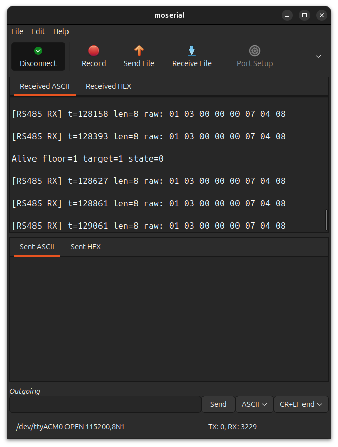
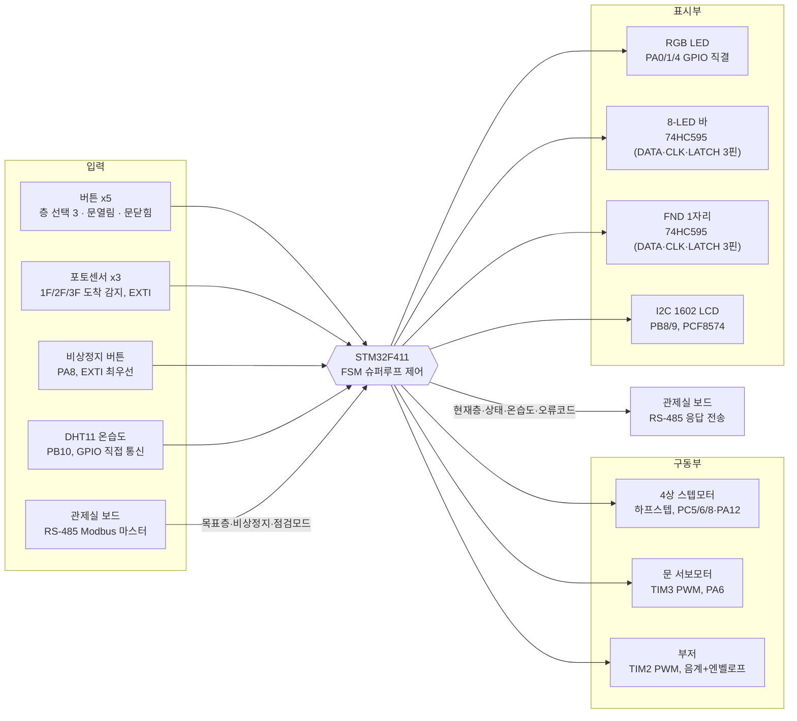
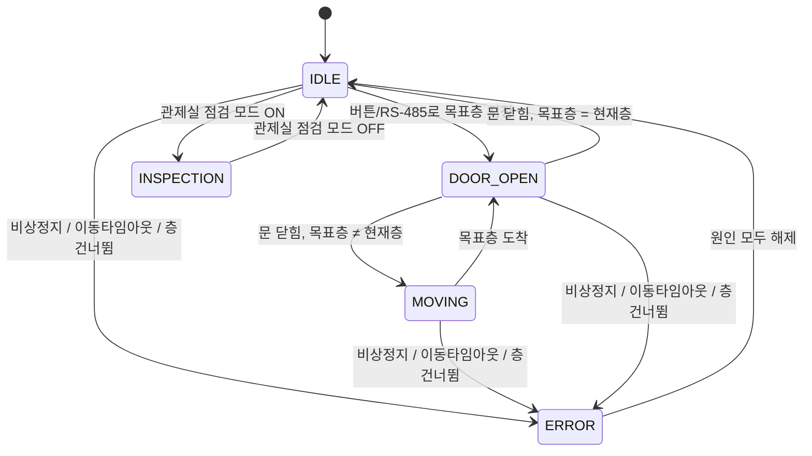
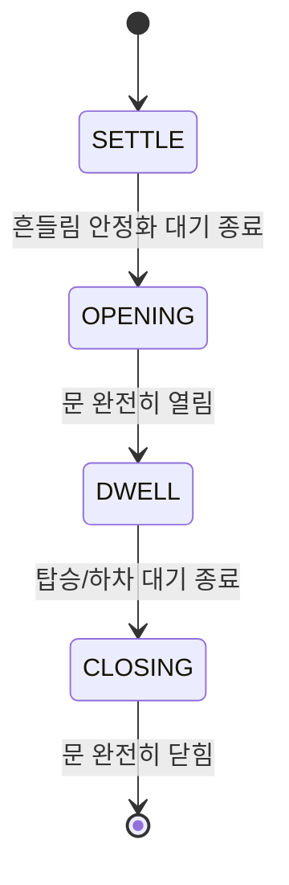

<div align="center">

# 🛗 STM32F411 엘리베이터 : RS-485 기반 분산형 제어 시스템

### RS-485-Based Distributed Control (Solo Project)

<br>


<br>


</div>
<br>

<!-- 사진/시연 영상 추후 첨부 예정 -->
<p align="center">
  
</p>

<br>

<p align="center">    &nbsp;  </p><p align="center"><i>디오라마 전면 (좌) · 후면 회로 구성 (우)</i></p>

<br>

3층 규모의 엘리베이터 카(car)를 논블로킹 FSM으로 제어하는 **STM32F411 기반 임베디드 시스템**입니다. 스텝모터로 카를 이동시키고, 서보모터로 문을 여닫으며, 포토센서로 층을 감지합니다. **RS-485(Modbus RTU)로 별도의 관제실 보드와 통신**하여 원격에서 목표층 지정, 비상정지 해제, 점검 모드 전환, 온·습도 모니터링이 가능하며, 이동 타임아웃·층 건너뜀·고온 경고 등을 감지하는 계층형 오류코드 체계(E101~E402)를 갖췄습니다.

<br>

## 0. 목차

1. [시연](#1-시연)
2. [핵심 기술 요약](#2-핵심-기술-요약)
3. [프로젝트 개요](#3-프로젝트-개요)
4. [주요 기능](#4-주요-기능)
5. [오류코드 체계](#5-오류코드-체계)
6. [RS-485 통신 상세](#6-rs-485-통신-상세)
7. [시스템 구성](#7-시스템-구성)
8. [아키텍처](#8-아키텍처)
9. [핀맵](#9-핀맵)
10. [상태 전이](#10-상태-전이)
11. [실행 구조](#11-실행-구조)
12. [설계 포인트](#12-설계-포인트)
13. [Troubleshooting](#13-troubleshooting)
14. [한계 및 차기 프로젝트 반영](#14-한계-및-차기-프로젝트-반영)
15. [빌드](#15-빌드)

<br>

## 1. 시연

<!-- 시연 GIF·영상은 추후 첨부 예정 -->

버튼으로 목표층을 누르면 문이 닫히고 스텝모터가 카를 이동시키며, 도착하면 문이 자동으로 열립니다. 관제실 보드에서 RS-485로 같은 명령(목표층 지정, 비상정지 해제 등)을 원격으로 내릴 수도 있고, LCD와 LED로 현재 상태·온습도·오류코드를 실시간 확인할 수 있습니다.

▶ **전체 시연 영상** : 추후 링크 첨부 예정 — 층 버튼 이동, RS-485 원격 제어, 비상정지·층 건너뜀·이동 타임아웃 오류 발생/해제, 점검 모드 전환

<br>

## 2. 핵심 기술 요약

| 분류 | 핵심 기술 |
|---|---|
| **MCU** | STM32F411RETx, STM32Cube HAL 기반 |
| **FSM** | 5-state 논블로킹 상태머신 (IDLE / MOVING / DOOR_OPEN / ERROR / INSPECTION) |
| **통신** | RS-485 반이중, Modbus RTU 슬레이브 직접 구현 (CRC16, 레지스터 맵 9종) |
| **PWM** | 서보모터(문 개폐) + 부저(음계+엔벨로프) 동시 구동 |
| **GPIO 직접 통신** | DHT11 온습도 센서 — 정해진 시간 간격(마이크로초 단위)에 맞춰 GPIO 핀 하나로 신호를 직접 주고받는 방식 |
| **모터 제어** | 4상 스텝모터 하프스텝 시퀀스 직접 구동, 거리 비례 이동 타임아웃 |
| **핀 절약 표시장치** | 74HC595 시프트레지스터로 LED 바(8개)·FND(7세그먼트)를 각각 핀 3개(DATA/CLK/LATCH)로 구동 — 병렬 GPIO 대비 핀 최대 5개 절약 |
| **안전 설계** | 히스테리시스 고온 경고, 층 건너뜀 감지, IWDG 워치독, 비상정지 EXTI 즉시 정지 |
| **구조** | 논블로킹 슈퍼루프, 3계층 아키텍처(App/BSP/Core), STM32CubeIDE 빌드 |

<br>

## 3. 프로젝트 개요

**기간** : 2026.06.24 ~ 2026.08.04 (실 작업일 6일) | **인원** : 개인 프로젝트

### 3-1. 프로젝트 일정

| 일정 | 단계 |
|---|---|
| 06.24 | FSM 제어 모듈 뼈대 구현 (엘리베이터 상태머신, 테스트벤치) |
| 07.19 | 3계층(App/BSP/Core) 구조로 전체 리팩토링, I2C LCD 연동, 점검 모드, RGB 상태 표시 추가 |
| 07.20 | 계층형 오류코드 체계(E101~E402) 및 거리 비례 이동 타임아웃 도입 |
| 07.27 | 오류코드 표시 로직과 층 이동 판정 로직 단순화 |
| 08.03 ~ 04 | 빌드 산출물 추적 해제·`.gitignore` 정리, 데드 코드 제거, 주석 정비 및 문서화 |

### 3-2. 담당 범위

개인 프로젝트로 하드웨어 배선부터 FSM 설계, Modbus 통신 프로토콜 구현, 오류코드 체계 설계, 디버깅까지 전 과정을 직접 진행했습니다. 관제실(F429, 마스터) 보드와 짝을 이루는 구조로, 이 저장소는 그중 **엘리베이터 카(F411, 슬레이브)** 쪽을 담당합니다.

<br>

## 4. 주요 기능

- **층 이동** : 버튼(1~3층) 또는 RS-485 원격 명령으로 목표층 지정 시 스텝모터가 카를 이동, 포토센서 3개(1F/2F/3F)로 도착 감지
- **문 개폐** : 도착 후 흔들림이 가라앉기를 기다렸다가(SETTLE) 문을 열고, 탑승/하차 대기(DWELL) 후 자동으로 닫힘(OPENING→DWELL→CLOSING) — 수동 문 열기/닫기 버튼도 지원
- **RS-485 원격 제어** : 관제실 보드가 Modbus RTU(0x03 읽기 / 0x06 쓰기)로 현재층·목표층·상태·온습도·오류코드를 조회하고, 목표층·비상정지·점검모드를 원격으로 설정
- **안전 잠금(ERROR)** : 비상정지 버튼, 이동 타임아웃(정해진 시간 안에 도착 못 함), 층 건너뜀(센서를 못 지나침) 중 하나라도 발생하면 즉시 정지 후 잠금, 원인이 모두 사라져야 해제
- **점검 모드(INSPECTION)** : 관제실이 RS-485로 점검 모드를 켜면 운행을 멈추고 대기, 관제실이 해제할 때까지 유지
- **환경 모니터링** : DHT11로 온·습도를 5초 주기로 측정, 고온(31℃ 이상) 시 경고 코드 발생(28℃ 이하로 내려가야 해제)
- **상태 표시** : LCD(I2C 1602)·RGB LED·8-LED 바(운행 방향)·7세그먼트(현재층/오류)로 상태를 동시에 표시

  **RGB LED — FSM 상태를 색으로 즉시 구분**

  | 색상 | 상태 | 표시 방식 |
  |---|---|---|
  | 🟢 GREEN | IDLE / DOOR_OPEN | 상시 점등 |
  | 🔵 BLUE | MOVING | 상시 점등 |
  | 🟡 YELLOW | INSPECTION | 0.5초 주기 점멸 |
  | 🔴 RED | ERROR | 0.5초 주기 점멸 |

  점멸 여부만으로도 "정상 동작(상시 점등) vs 개입 필요(점멸)"를 구분할 수 있고, INSPECTION·ERROR는 색만 다르고 점멸 방식은 동일하게 맞춰 일관성을 뒀습니다.

  **8-LED 바 / 7세그먼트(FND) — 74HC595 시프트레지스터로 핀 절약**

  LED 8개, 7세그먼트 7개를 MCU GPIO에 하나씩 직결하면 각각 8핀, 7핀이 필요합니다. 대신 74HC595 1개씩을 사이에 두고 **DATA(직렬 데이터) · CLK(시프트 클럭) · LATCH(출력 반영) 3개 핀**만으로 8비트 전체를 제어합니다. MCU가 한 비트씩 밀어 넣고 LATCH를 올리는 순간 8비트가 한 번에 출력에 반영되는 방식이라, 두 장치를 합쳐 15핀이 필요했던 걸 6핀으로 줄인 셈입니다.

<br>

## 5. 오류코드 체계

FSM은 매 루프마다 여러 오류 조건을 우선순위 순서로 검사해 **정수 하나(`error_code`)로 요약**합니다. 뒤에 검사하는 항목일수록 우선순위가 높아, 여러 조건이 동시에 발생해도 가장 심각한 코드 하나만 남습니다.

| 코드 | 분류 | 의미 | 발생 조건 | 해제 조건 |
|---|---|---|---|---|
| **101** | 환경/센서 | 고온 경고 | 온도가 31℃ 이상으로 올라감 | 온도가 28℃ 이하로 내려감 (히스테리시스) |
| **102** | 환경/센서 | DHT 응답 없음 | DHT11 센서가 응답 시간 안에 신호를 보내지 않음(타임아웃) | 다음 측정 주기(5초)에 정상 응답 수신 |
| **103** | 환경/센서 | DHT 체크섬 오류 | DHT11이 보낸 5바이트 데이터의 체크섬이 맞지 않음(통신 잡음 의심) | 다음 측정 주기(5초)에 정상 응답 수신 |
| **201** | 구동 | 이동 타임아웃 | 정해진 시간 안에 목표층에 도착하지 못함(모터 걸림·센서 고장 의심) | 관제실이 RS-485로 비상정지 레지스터(3번)에 0을 씀 |
| **301** | 위치 | 층 건너뜀 | 1↔3층처럼 중간층을 반드시 지나야 하는 이동에서, 2층 센서를 지난 기록 없이 목표층에 도착(센서를 놓친 것으로 판단) | 관제실이 RS-485로 비상정지 레지스터(3번)에 0을 씀 |
| **401** | 운행정지 | 물리 비상정지 | 비상정지 버튼(PA8) 누름, EXTI로 즉시 발생·모터 즉시 정지 | 관제실이 RS-485로 비상정지 레지스터(3번)에 0을 씀 — 버튼 자체는 눌림 상태를 소프트웨어가 계속 기억(래치)하므로 관제실의 원격 해제가 있어야만 풀림 |
| **402** | 운행정지 | 점검 모드 | 관제실이 RS-485로 점검모드 레지스터(7번)에 1을 씀 | 관제실이 점검모드 레지스터(7번)에 0을 씀 |

**우선순위(낮음 → 높음)** : 101 → 102 → 103 → 201 → 301 → 402 → **401**

물리 비상정지(401)는 항상 마지막에 검사되어 다른 어떤 오류코드보다도 최종 우선순위를 갖습니다. 그리고 비상정지 레지스터에 0을 쓰는 "비상 해제" 동작 하나가 401뿐 아니라 201·301 래치까지 한 번에 풀어주도록 묶여 있어, 관제실에 별도의 "오류 초기화" 버튼을 두지 않고도 전체 잠금을 해제할 수 있습니다. (설계 배경은 [12. 설계 포인트](#12-설계-포인트) 참고)

<br>

## 6. RS-485 통신 상세

### 6-1. 통신 규격

| 항목 | 값 |
|---|---|
| 물리 계층 | RS-485 반이중(half-duplex), 2선식 |
| UART | USART1, PA9(TX) / PA10(RX) |
| 통신 속도 | 115200bps, 8N1 |
| 프로토콜 | Modbus RTU |
| 슬레이브 주소 | 1 (`MODBUS_SLAVE_ID`) |
| 지원 기능코드 | 0x03 (Read Holding Registers) / 0x06 (Write Single Register) |
| 방향 전환 | 자동 방향전환(오토센싱) RS-485 모듈 사용 — MCU가 DE/RE 핀을 직접 제어하지 않음 |

이 보드는 항상 **슬레이브(응답자)** 이고, 관제실(F429) 보드가 **마스터(질의자)** 로서 먼저 요청을 보내야만 응답합니다.

### 6-2. 레지스터 맵

| 주소 | 이름 | 접근 | 설명 |
|---|---|---|---|
| 0 | REG_CURRENT_FLOOR | R | 현재층 (1~3) |
| 1 | REG_TARGET_FLOOR | R/W | 목표층 (1~3) — 관제실 호출 버튼이 여기에 씀 |
| 2 | REG_PENDING_ACTION | R | FSM 상태 — 0 IDLE / 1 MOVING / 2 DOOR_OPEN / 3 ERROR / 4 INSPECTION |
| 3 | REG_EMERGENCY | R/W | 비상정지 상태 — 0을 쓰면 오류 전체(101/201/301/401) 잠금 해제 |
| 4 | REG_TEMPERATURE_X10 | R | 온도 × 10 (예 : 23.5℃ → 235) |
| 5 | REG_HUMIDITY_X10 | R | 습도 × 10 |
| 6 | REG_DHT_STATUS | R | DHT 상태 — 0 정상 / 1 타임아웃 / 2 체크섬오류 |
| 7 | REG_INSPECTION | R/W | 점검 모드 — 0 정상 / 1 점검중 |
| 8 | REG_ERROR_CODE | R | 통합 오류코드 (5. 오류코드 체계 참고) |

### 6-3. 프레임 구조

**요청(마스터 → 슬레이브)**, 항상 8바이트 고정

| 슬레이브ID | 기능코드 | 주소(상위) | 주소(하위) | 값/개수(상위) | 값/개수(하위) | CRC(하위) | CRC(상위) |
|---|---|---|---|---|---|---|---|
| 1B | 1B | 1B | 1B | 1B | 1B | 1B | 1B |

**응답 — 0x03(읽기)**

`[슬레이브ID][0x03][데이터 바이트수][레지스터값...2바이트씩][CRC 하위][CRC 상위]`

**응답 — 0x06(쓰기)**

받은 요청 6바이트(슬레이브ID~값)를 그대로 에코 + CRC 2바이트 (Modbus 0x06 표준 응답 형식)

CRC는 Modbus RTU 표준(초깃값 0xFFFF, 다항식 0xA001)으로 계산하고, **하위 바이트를 먼저** 보냅니다(다른 필드는 반대로 상위 바이트가 먼저라 헷갈리기 쉬운 부분).

### 6-4. 타이밍 설계

- **프레임 경계 판정** : Modbus RTU는 프레임 사이의 침묵 구간으로 경계를 구분하는 규격입니다. 마지막 바이트 수신 후 **5ms 이상** 조용하면 그 시점까지 받은 바이트를 하나의 완성된 프레임으로 보고 해석합니다. 115200bps에서 1바이트 전송 시간은 약 0.09ms라 5ms 공백은 정상적인 프레임 도중에는 발생할 수 없는 간격이라 안전한 기준입니다.
- **응답 전 지연 30ms** : 요청을 받자마자 바로 응답을 보내면, 마스터 쪽 자동 방향전환 모듈이 송신 모드에서 수신 모드로 채 돌아오기 전이라 응답 앞부분을 놓칩니다. 마스터의 응답 대기 한계(약 100ms)보다 충분히 짧은 30ms를 지연으로 두어 이 문제를 피합니다.
- **쓰기 실패 시 무응답** : 0x06 쓰기 요청이 허용 범위를 벗어나면(예: 목표층 4) 아무 응답도 보내지 않습니다. 표준 Modbus 예외 응답(0x86)은 아직 구현하지 않아, 마스터는 100ms 타임아웃 후 재시도로 실패를 알아챕니다. ([14. 한계 및 차기 프로젝트 반영](#14-한계-및-차기-프로젝트-반영) 참고)

### 6-5. 실측 통신 로그

관제실(마스터)이 5개 연속 레지스터(주소 0, 개수 7)를 반복 조회하는 폴링 요청과, 엘리베이터(슬레이브)가 그 요청을 정상 수신하는 모습을 각 보드의 디버그 UART(USART2)로 함께 캡처했습니다.

<p align="center">
  
  
</p>
<p align="center"><i>엘리베이터 보드 수신 로그(좌) · 관제실 보드 송신 로그(우)</i></p>

엘리베이터 보드 수신 로그(좌)는 관제실이 보낸 요청을 그대로 수신하며 1초 주기 생존 로그(Alive)와 번갈아 출력하며 관제실 보드 송신 로그(우)는 동일한 요청 프레임을 주기적으로 재전송합니다.
두 로그의 raw 바이트(`01 03 00 00 00 07 04 08`)가 정확히 일치해, 슬레이브 주소·기능코드·CRC까지 양쪽이 같은 프레임을 주고받고 있음을 확인했습니다.

<br>

## 7. 시스템 구성



<br>

## 8. 아키텍처

CubeMX가 생성한 HAL 초기화 코드(`Core/`)와, 직접 작성한 디바이스 드라이버(`BSP/`)·제어 정책(`App/`)을 분리한 구조입니다.

```
┌──────────────────────────────────────────────────┐
│                                                  │
│   App/       제어 정책 (FSM, 언제·왜 동작하는가)  │
│              app_elevator_fsm · app_rs485_ctrl   │
│                                                  │
├──────────────────────────────────────────────────┤
│                                                  │
│   BSP/       부품 드라이버 (부품과 어떻게 대화하나) │
│              dev_button · dev_servo · dev_stepper│
│              dev_buzzer · dev_dht · dev_photo    │
│              dev_display (LCD/RGB/LED바/FND) │
│                                                  │
├──────────────────────────────────────────────────┤
│                                                  │
│   Core/      CubeMX HAL 초기화 (레지스터 설정)   │
│              gpio · tim · usart · i2c · iwdg     │
│                                                  │
└──────────────────────────────────────────────────┘
```

`dev_display` 하나의 모듈 안에서도 표시장치별로 책임을 나눠 관리합니다.

| 표시장치 | 제어 방식 | 사용 핀 수 |
|---|---|---|
| RGB LED | GPIO 3개 직접 On/Off | 3핀 |
| 8-LED 바 | 74HC595 시프트레지스터 (직렬 입력 → 병렬 출력) | 3핀 (병렬 직결 시 8핀) |
| FND(7세그먼트) | 74HC595 시프트레지스터 | 3핀 (병렬 직결 시 7핀) |
| I2C LCD | I2C1 (PCF8574 백팩이 8비트를 확장) | 2핀 |

FSM은 `Display_Update(state, error_code)` 한 번 호출로 위 네 장치를 한꺼번에 갱신하도록 해서, `App/` 계층은 "지금 RGB가 몇 번 핀인지, FND가 시프트레지스터인지"를 몰라도 되게 분리했습니다.

```
Project02_Elevator/
├── Core/
│   ├── Inc, Src             # CubeMX 생성 HAL 초기화 (gpio/tim/usart/i2c/iwdg), main.c
│   └── Startup              # 스타트업 어셈블리, 링커 스크립트
├── BSP/
│   ├── Inc, Src
│   │   ├── dev_button       # 버튼 5개 스캔 + 디바운싱
│   │   ├── dev_buzzer       # PWM 음계 시퀀스 + 감쇠 엔벨로프
│   │   ├── dev_dht          # DHT11 온습도 (GPIO 직접 통신)
│   │   ├── dev_display      # LED바(74HC595)·FND(74HC595)·RGB·I2C LCD 통합 표시
│   │   ├── dev_photo        # 포토센서 EXTI 처리, 부팅 시 현재층 감지
│   │   └── dev_stepper      # 4상 스텝모터 하프스텝 구동
├── App/
│   ├── Inc, Src
│   │   ├── app_elevator_fsm # 5-state FSM, 오류코드 계산
│   │   └── app_rs485_ctrl   # Modbus RTU 슬레이브, CRC16, 레지스터 맵
├── Drivers/                 # CMSIS + STM32F4xx HAL (표준 라이브러리)
├── Project02_Elevator.ioc   # CubeMX 설정 파일
└── STM32F411RETX_FLASH.ld / _RAM.ld   # 링커 스크립트
```

<br>

## 9. 핀맵

| 기능 | 핀 | 비고 |
|---|---|---|
| RGB 상태 LED (R/G/B) | PA0 / PA1 / PA4 | 공통캐소드, GPIO 직접 제어 |
| 부저 | PA5 | Timer2 CH1 PWM |
| 문 서보모터 | PA6 | Timer3 CH1 PWM, 50Hz |
| LED 바 데이터(DS) | PA7 | 74HC595 시프트레지스터 |
| 비상정지 버튼 | PA8 | EXTI, 최우선 인터럽트 |
| RS-485 (USART1) | PA9(TX) / PA10(RX) | Modbus RTU, 115200bps |
| 포토센서 1층 | PA11 | EXTI |
| 스텝모터 IN4 | PA12 | GPIO 출력 |
| 디버그 출력 (USART2) | PA2(TX) / PA3(RX) | printf 리타겟 |
| 층 버튼(1층) | PB1 | 내부 풀업 |
| 포토센서 3층 | PB2 | EXTI |
| FND 래치(RCLK) / 클럭(SRCLK) / 데이터(SER) | PB3 / PB4 / PB5 | 74HC595 시프트레지스터 |
| LED 바 클럭(SRCLK) | PB6 | 74HC595 시프트레지스터 |
| I2C1 (LCD) | PB8(SCL) / PB9(SDA) | PCF8574 백팩 1602 LCD |
| DHT11 데이터 | PB10 | 내부 풀업, 단선 통신 |
| 포토센서 2층 | PB12 | EXTI |
| 문 열기 버튼 | PB13 | 내부 풀업 |
| 층 버튼(3층) | PB14 | 내부 풀업 |
| 층 버튼(2층) | PB15 | 내부 풀업 |
| 문 닫기 버튼 | PC4 | 내부 풀업 |
| 스텝모터 IN1 / IN2 / IN3 | PC5 / PC6 / PC8 | GPIO 출력, 하프스텝 시퀀스 |
| LED 바 래치(RCLK) | PC7 | 74HC595 시프트레지스터 |

<br>

## 10. 상태 전이

### 10-1. 엘리베이터 FSM (5-state)



ERROR가 다른 모든 상태보다 우선 검사되며, 원인 세 가지(비상정지·층 건너뜀·이동 타임아웃)가 모두 사라져야 IDLE로 복귀합니다.

### 10-2. 문 동작 (DOOR_OPEN 내부 4단계)



각 단계는 `HAL_Delay` 없이 `HAL_GetTick()` 경과시간만으로 전환되어, 문이 움직이는 중에도 워치독 갱신과 다른 입력 처리가 계속 돌아갑니다.

<br>

## 11. 실행 구조

RTOS 없이 슈퍼루프 기반으로 동작합니다. 매 반복마다 FSM 갱신, 상태 표시, 각종 논블로킹 서비스, 워치독 갱신을 순서대로 처리합니다.

```
loop (매 반복)
 ├─ Elevator_FSM_Update()      비상/점검 감지 → 상태 처리 → 오류코드 계산 → 모터 스텝 → 화면 갱신
 ├─ LED_Bar_Update()           운행 방향 LED 애니메이션 (논블로킹)
 ├─ Buzzer_Update()            음계 재생 + 감쇠 엔벨로프 (논블로킹)
 ├─ FND_Scan()                 7세그먼트 표시 갱신
 ├─ DHT_Update()               5초 주기로 온습도 재측정
 ├─ Modbus_Update()            5ms 이상 침묵 시 수신 프레임 해석/응답
 ├─ 1초 주기 생존 로그 출력 (현재층/목표층/FSM 상태)
 └─ HAL_IWDG_Refresh()         루프 맨 끝에서 워치독 갱신
```

포토센서 인터럽트(층 도착)와 비상정지 인터럽트(EXTI)는 모터 정지 같은 즉시 처리만 담당하고, LED·부저·문 동작 등 시간이 걸리는 후처리는 모두 메인루프에서 일괄 처리합니다.

<br>

## 12. 설계 포인트

- **논블로킹 FSM** : `Elevator_FSM_Update()`는 절대 `HAL_Delay`로 멈추지 않고 `HAL_GetTick()` 경과시간만 비교합니다. 메인루프가 멈추면 IWDG 워치독이 리셋을 걸기 때문입니다.
- **ISR은 최소한만** : 포토센서·비상정지 인터럽트는 위치 갱신과 모터 정지만 수행하고, 부저·LED 같은 후처리는 메인루프로 넘깁니다. ISR 안에서 오래 걸리는 작업을 하면 다른 인터럽트(특히 층 감지)를 놓칠 수 있기 때문입니다.
- **거리 비례 이동 타임아웃(E201)** : 한 층 이동과 두 층(1↔3) 이동의 타임아웃 기준을 다르게 두어(2배), 정상적인 두 층 이동을 오류로 오판하지 않도록 했습니다.
- **층 건너뜀 감지(E301)** : 1↔3층처럼 중간에 반드시 2층을 거쳐야 하는 이동에서, 2층 센서를 지난 기록이 없는데 목표층에 도착했다면 센서 오작동으로 판단해 잠금 처리합니다.
- **히스테리시스** : 고온 경고(31℃ 켜짐 / 28℃ 꺼짐)에 서로 다른 켜짐·꺼짐 기준을 두어 경계값 부근에서 경고가 반복적으로 깜빡이는 현상을 방지했습니다.
- **부팅 시 위치 동기화(호밍)** : 전원을 켤 때 포토센서 3개를 레벨로 직접 읽어 실제 위치를 확인합니다. 이 과정이 없으면 2층·3층에서 전원이 켜졌을 때 소프트웨어가 1층이라고 오판해 첫 이동이 엉뚱한 방향으로 나갈 수 있습니다.
- **비상 해제 하나로 오류 전체 잠금 해제** : 관제실이 비상정지 레지스터에 0을 쓰는 동작 하나에 E401뿐 아니라 E201·E301 래치 해제까지 묶어, 관제실에 오류 종류별 해제 버튼을 따로 두지 않아도 되게 했습니다.
- **RS-485 프레임 경계 판정** : Modbus RTU는 프레임 사이의 침묵 구간으로 경계를 구분하는 방식이라, 마지막 바이트로부터 5ms 이상 조용하면 프레임이 끝났다고 보고 해석합니다.

<br>

## 13. Troubleshooting

### 13-1. 스텝모터 풀스텝 전환 시도 → 탈조 발생

- **문제** : 하프스텝(8단계) 대신 풀스텝(4단계)으로 바꿔 이동 속도를 2배로 높이려 했으나, 한 스텝당 회전각이 커지면서 이 부하·속도 조건에서 로터가 따라가지 못하고 탈조(스텝을 놓치는 현상)가 발생
- **해결** : 하프스텝 시퀀스로 되돌리고, 속도는 스텝 간격(`STEP_INTERVAL_MS`) 값을 조정하는 방식으로만 제어
- **배운 점** : 이론적인 속도 향상이 실제 부하 조건에서 그대로 적용되지 않을 수 있으며, 모터 제어는 반드시 실측으로 검증해야 함

### 13-2. RS-485 응답 시점 문제 → 지연 추가

- **문제** : 요청을 받자마자 곧바로 응답을 보내면, 반이중 방식인 RS-485의 특성상 마스터(관제실) 쪽 자동 방향전환 모듈이 송신 모드에서 수신 모드로 다 돌아오기 전이라 응답 앞부분을 놓침
- **해결** : 응답 전송 전 30ms 지연을 추가 (마스터의 응답 대기 한계인 100ms보다 충분히 짧은 값)
- **배운 점** : 반이중 통신에서는 방향 전환에 걸리는 물리적 시간을 고려해야 하며, 프로토콜 규격만이 아니라 실제 하드웨어 모듈의 응답 특성도 함께 봐야 함

### 13-3. 전원 인가 시점에 따른 위치 오판

- **문제** : 포토센서 인터럽트는 상태가 바뀌는 순간(엣지)에만 걸리므로, 2층이나 3층에 카가 서 있는 상태로 전원을 켜면 인터럽트가 발생하지 않아 소프트웨어는 항상 1층이라고 인식. `current_floor`가 부팅 시 `1`로 하드코딩되어 있었던 것이 원인
- **해결** : 부팅 시 한 번, 3개 포토센서 핀을 인터럽트가 아닌 레벨(현재 상태)로 직접 읽는 `Photo_DetectCurrentFloor()` 함수를 추가하고, `Elevator_FSM_Init()`에서 호출해 `current_floor`·`target_floor`를 실제 위치로 동기화
- **배운 점** : 인터럽트 기반 감지는 "변화"만 알 수 있고 "현재 상태"는 알려주지 않으므로, 초기화 시점에는 별도의 상태 확인 절차가 필요함

### 13-4. LCD 응답 지연으로 인한 워치독 리셋 무한 루프

- **문제** : 비상정지 테스트 중 LCD·FND·LED바가 멈춘 것처럼 보이고 리셋 버튼도 먹히지 않음. 시리얼 로그에는 `[SERVO] Init Success...` → `=== Elevator Start ===`가 계속 반복 출력되어, 사실은 보드가 초 단위로 스스로 리셋을 반복하고 있었음
- **원인** : IWDG 타임아웃이 약 4초(`IWDG_PRESCALER_64`, `Reload=2000`)로 설정돼 있었는데, LCD 쓰기 함수 `lcd_i2c_write()`가 `HAL_I2C_Master_Transmit(..., 100)`으로 매 호출 최대 100ms까지 대기하는 구조라, 배선 문제로 LCD가 응답하지 않으면 문자 한 줄만 갱신해도(니블 단위로 수십 번 호출) 워치독 타임아웃 4초를 가볍게 넘겨버림. `HAL_IWDG_Refresh()`는 `while(1)` 루프 맨 끝에서만 호출되므로 그 지점에 도달하기 전에 워치독이 강제로 리셋 → 처음부터 재부팅을 반복
- **해결** : `dev_display.c`에서 부팅 시 딱 한 번, 짧은 타임아웃(10ms)의 `HAL_I2C_IsDeviceReady()`로 LCD 응답 여부를 확인하고, 응답이 없으면 `s_lcd_present = 0`으로 이후 모든 LCD I2C 쓰기를 건너뛰도록 방어 코드 추가. LCD가 없거나 배선이 안 맞아도 모터·FND·부저·RS-485 등 나머지 시스템은 정상 구동됨
- **배운 점** : 워치독은 "메인루프가 도는지"만 보장할 뿐 "루프 안의 한 단계가 오래 걸리는지"는 못 잡아낸다. 응답이 느리거나 실패할 수 있는 외부 통신(I2C 등)은 항상 짧은 타임아웃과 "없어도 동작은 계속되는" 방어 로직을 함께 둬야 함

<br>

## 14. 한계 및 차기 프로젝트 반영

| 현재 한계 | 개선 방향 |
|---|---|
| Modbus 응답 전송 전 `HAL_Delay(30ms)`로 메인루프 전체가 블로킹됨 — 그동안 스텝모터 타이밍·LED바 애니메이션·부저 엔벨로프가 밀릴 수 있어, 프로젝트의 논블로킹 설계 원칙과 상충 | 차기 프로젝트는 마스터가 순서대로 물어야만 응답이 오는 폴링 구조 자체가 없는 **CAN 버스**로 전환 — 각 노드가 필요할 때 바로 송신하고, 우선순위 기반 중재(arbitration)로 비상 메시지가 다른 트래픽에 밀리지 않고 먼저 전달됨 |
| 스텝모터 정지 시 코일 전류를 끊어 유지 토크가 사라지므로 정지 위치가 미세하게 밀릴 수 있고, 실제 이동 속도도 측정하지 못함 | 바퀴에 **포토인터럽터**를 달아 회전수 기반으로 실시간 속도·이동거리를 측정, 정지 위치 보정에 활용 |
| 포토센서 3개만으로 층을 판별해 센서 고장 시 위치를 잃어버릴 수 있음 | **자이로센서**로 기울기·가속도를 함께 감지해, 포토센서가 고장 나도 관성 정보로 위치·이상 동작을 이중으로 확인 |

<br>

## 15. 빌드

STM32CubeIDE 프로젝트로, GCC 기반 GNU Tools for STM32 툴체인을 사용합니다.

**STM32CubeIDE (권장)**

1. STM32CubeIDE에서 `File > Import > Existing Projects into Workspace`로 프로젝트 폴더 선택
2. 프로젝트 우클릭 → `Build Project` (또는 Ctrl+B)
3. ST-Link로 보드 연결 후 `Run` 또는 `Debug`로 플래시

**커맨드라인 (Make, GNU Tools for STM32 설치 후)**

```bash
cd Debug
make -j
```

빌드 산출물 : `Debug/Project02_Elevator.elf`, `.map`, `.list`
